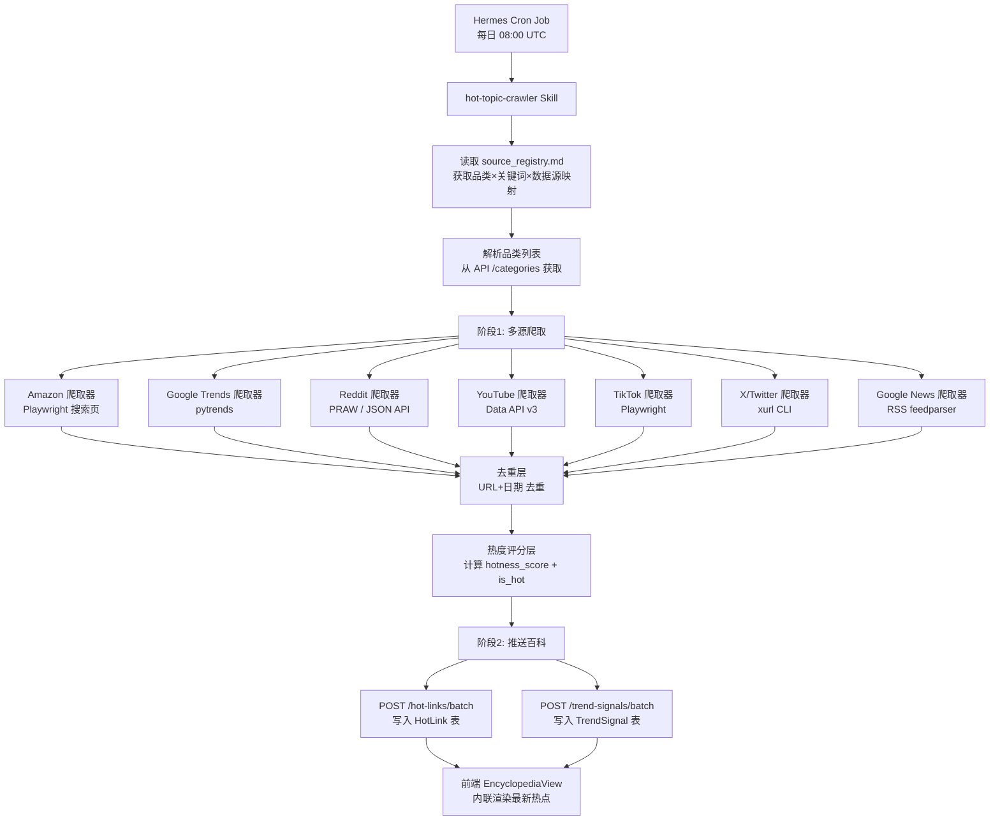

# 舆情热点爬取 Agent 实施方案

> **For Hermes:** Use subagent-driven-development skill to implement this plan task-by-task.

**Goal:** 构建一个专业的热点爬取 Agent，每日自动从 Amazon/Google Trends/Reddit/YouTube/TikTok/X/Google News 等数据源爬取舆情与市场趋势数据，写入 `hot_links` 和 `trend_signals` 表，前端实时渲染最新热点。

**Architecture:** 爬取 Agent 作为独立 Hermes Skill 运行，通过 Cron Job 每日触发。Agent 内部分两阶段：(1) 多源爬取阶段 — 并行调用各数据源 API/RSS/浏览器自动化，提取结构化数据；(2) 推送阶段 — 通过品类百科后端 Batch API 写入 `hot_links` + `trend_signals`。与现有 Amazon 本地文件导入（`POST /imports/amazon` → `ListingSnapshot`）完全独立，零冲突。

**Tech Stack:** Python 3.11, httpx (HTTP), feedparser (RSS), pytrends (Google Trends), PRAW (Reddit), google-api-python-client (YouTube), Playwright (Amazon/TikTok/X 浏览器自动化), Hermes Cron Job + Skill

---

## 一、冲突分析：数据导入入口 vs 舆情爬取

### 结论：**零冲突，完全独立的数据流**

```mermaid
flowchart LR
    subgraph "现有数据导入（本地文件 → 产品快照）"
        A1[本地 JSON/CSV 文件] -->|POST /imports/amazon| A2[ImportJob]
        A2 --> A3[ListingSnapshot 表]
    end

    subgraph "新增舆情爬取（在线爬取 → 热点/趋势）"
        B1[Amazon搜索页] --> B4[爬取Agent]
        B2[Google Trends API] --> B4
        B3[Reddit/YouTube/X] --> B4
        B4 -->|POST /hot-links/batch| B5[HotLink 表]
        B4 -->|POST /trend-signals/batch| B6[TrendSignal 表]
    end

    A3 -.-"独立表，无关联"-.- B5
    A3 -.-"独立表，无关联"-.- B6
```

| 维度 | Amazon 本地导入 | 舆情热点爬取 |
|------|----------------|-------------|
| 数据源 | 本地文件系统 JSON/CSV | 在线 API/RSS/浏览器 |
| 入口 API | `POST /api/v1/imports/amazon` | `POST /api/v1/hot-links/batch` + `POST /api/v1/trend-signals/batch` |
| 写入表 | `listing_snapshots` | `hot_links` + `trend_signals` |
| 触发方式 | 人工手动触发 | Cron Job 每日自动 |
| 角色 | 产品详情快照（ASIN/价格/评分） | 热点跳转链接 + 趋势信号 |
| 冲突 | 无 | 无 |

### 前提条件已满足
- ✅ `hot_links` 表已有 `hotness_score`、`is_hot`、`collected_at` 字段 + 索引
- ✅ `trend_signals` 表已有 `metric_value`、`metric_unit`、`trend_direction`、`collected_at` 字段 + 索引
- ✅ Batch API 已就绪（`POST /hot-links/batch` max 500 items, `POST /trend-signals/batch` max 500 items）
- ✅ `platform` Literal 已覆盖全部数据源（google/amazon/reddit/youtube/tiktok/x/facebook/news/other）
- ✅ `link_type` Literal 已覆盖（product/discussion/video/news/trend/keyword）
- ✅ `signal_type` Literal 已覆盖（search_volume/best_seller_rank/social_mention/keyword_trend/news_volume/review_sentiment）
- ✅ 前端 EncyclopediaView 已加载 hot_links + trend_signals，已有 trend_signals 卡片渲染
- ✅ data/source_registry.md 已注册全部数据源 + 跳转链接模板

---

## 二、方案设计

### 2.1 整体架构



### 2.2 Hermes Skill 设计

创建一个名为 `hot-topic-crawler` 的 Skill，放在 `productivity` 分类下（与品类百科项目相关）。

**Skill 文件结构：**
```
~/.hermes/skills/productivity/hot-topic-crawler/
├── SKILL.md                    # 主技能文件
├── references/
│   └── source-mapping.md       # 品类→关键词→数据源映射表
├── scripts/
│   ├── crawl_amazon.py         # Amazon 搜索页爬取
│   ├── crawl_google_trends.py  # Google Trends 爬取
│   ├── crawl_reddit.py         # Reddit 爬取
│   ├── crawl_youtube.py        # YouTube 爬取
│   ├── crawl_tiktok.py         # TikTok 爬取
│   ├── crawl_x_twitter.py      # X/Twitter 爬取
│   ├── crawl_google_news.py    # Google News RSS 爬取
│   ├── dedup_and_score.py      # 去重 + 热度评分
│   └── push_to_encyclopedia.py  # 推送到百科后端
└── templates/
    └── crawl_config.yaml       # 爬取配置模板
```

### 2.3 Cron Job 调度

| 参数 | 值 | 说明 |
|------|-----|------|
| schedule | `0 8 * * *` | 每日 UTC 08:00（北京 16:00）|
| skills | `["hot-topic-crawler"]` | 加载爬取技能 |
| deliver | `origin` | 结果发回当前会话（或设为 Telegram 通知）|
| enabled_toolsets | `["terminal", "web"]` | 只加载终端 + Web 工具 |
| workdir | 项目路径 | `/Users/luka/Documents/Product Category Encyclopedia` |

### 2.4 热度评分算法

```python
# hotness_score 计算（0-100 归一化）
def calculate_hotness(metrics: dict) -> float:
    """
    metrics 可能包含:
    - upvotes / comment_count (Reddit)
    - view_count / like_count (YouTube/TikTok)
    - rating_count / review_count (Amazon)
    - search_interest (Google Trends 0-100)
    """
    score = 0.0
    if 'upvotes' in metrics:
        score += min(metrics['upvotes'] / 100, 30)  # 最多 30 分
    if 'comment_count' in metrics:
        score += min(metrics['comment_count'] / 50, 20)  # 最多 20 分
    if 'view_count' in metrics:
        score += min(metrics['view_count'] / 10000, 25)  # 最多 25 分
    if 'like_count' in metrics:
        score += min(metrics['like_count'] / 500, 15)  # 最多 15 分
    if 'search_interest' in metrics:
        score += min(metrics['search_interest'] / 4, 10)  # 最多 10 分 (Trends 0-100 → 0-25)
    return round(min(score, 100), 2)

# is_hot 阈值
IS_HOT_THRESHOLD = 60.0  # hotness_score >= 60 标记为 is_hot=True
```

### 2.5 去重策略

```python
# 按 URL + 当日去重，同一条 URL 一天只写入一次
def deduplicate(items: list[dict]) -> list[dict]:
    seen = set()
    result = []
    today = datetime.now(UTC).strftime('%Y-%m-%d')
    for item in items:
        key = f"{item['url']}|{today}"
        if key not in seen:
            seen.add(key)
            result.append(item)
    return result
```

---

## 三、实施任务

### Task 1: 创建 hot-topic-crawler Skill 框架

**Objective:** 创建 Skill 目录结构和主 SKILL.md 文件

**Files:**
- Create: `~/.hermes/skills/productivity/hot-topic-crawler/SKILL.md`
- Create: `~/.hermes/skills/productivity/hot-topic-crawler/references/source-mapping.md`
- Create: `~/.hermes/skills/productivity/hot-topic-crawler/templates/crawl_config.yaml`

**Step 1: 创建 source-mapping.md 参考文件**

从 `data/source_registry.md` 中提取品类×关键词×数据源的映射，生成结构化参考文件：

```markdown
# 品类×关键词×数据源映射

## 品类列表（从 /api/v1/categories 获取）
- HEAT_THERAPY → 热疗
- FAR_INFRARED → 远红外热疗
- SHOULDER_NECK_HEAT_THERAPY → 肩颈热敷
- NIGHT_LIGHT → 夜灯
- PILL_ORGANIZER → 药盒
- PILL_SPLITTER → 切药器
- SEAT_CUSHION → 办公坐垫
- TENS_THERAPY → 电疗TENS

## 关键词映射（品类 → 搜索关键词列表）
### HEAT_THERAPY
- heating pad
- heat wrap neck shoulder
- far infrared heating pad

### TENS_THERAPY
- TENS unit
- TENS unit pads
- TENS machine

### NIGHT_LIGHT
- night light motion sensor
- baby night light

### PILL_ORGANIZER
- pill organizer weekly
- pill splitter

### SEAT_CUSHION
- seat cushion office chair
- tailbone cushion
```

**Step 2: 创建 crawl_config.yaml 模板**

```yaml
# 爬取配置
api_base_url: "http://localhost:8000/api/v1"
categories:
  - code: "HEAT_THERAPY"
    section_key: "market"
  - code: "TENS_THERAPY"
    section_key: "market"
  - code: "NIGHT_LIGHT"
    section_key: "market"
  - code: "PILL_ORGANIZER"
    section_key: "market"
  - code: "SEAT_CUSHION"
    section_key: "market"

# 数据源开关
sources:
  amazon:
    enabled: true
    priority: P0
    method: playwright
  google_trends:
    enabled: true
    priority: P0
    method: pytrends
  reddit:
    enabled: true
    priority: P1
    method: praw
  youtube:
    enabled: true
    priority: P2
    method: youtube_api
  tiktok:
    enabled: false  # 需要申请 Research API
    priority: P2
    method: playwright
  x_twitter:
    enabled: false  # API v2 需付费
    priority: P2
    method: xurl
  google_news:
    enabled: true
    priority: P1
    method: rss

# 热度评分
scoring:
  is_hot_threshold: 60.0
  max_hot_links_per_category: 50
  max_trend_signals_per_category: 30

# 去重
dedup:
  strategy: "url_plus_date"
```

**Step 3: 创建 SKILL.md 主文件**

```markdown
---
name: hot-topic-crawler
description: "舆情热点爬取 Agent：每日自动从 Amazon/Google Trends/Reddit/YouTube/TikTok/X/Google News 爬取舆情与市场趋势数据，写入品类百科的 hot_links 和 trend_signals 表。"
version: 1.0.0
metadata:
  hermes:
    tags: [crawler, scraping, hot-topic, encyclopedia, automation]
    related_skills: [amazon-category-encyclopedia]
---

# 舆情热点爬取 Agent

## 触发条件
- Cron Job 每日自动触发
- 手动调用：用户要求"爬取热点"或"更新舆情数据"

## 执行流程

### 阶段 1: 多源爬取

1. 读取 `references/source-mapping.md` 获取品类×关键词映射
2. 读取 `templates/crawl_config.yaml` 获取数据源开关配置
3. 调用 `GET /api/v1/categories` 获取当前品类列表
4. 按 P0→P1→P2 优先级顺序，对每个品类并行爬取：
   - P0: Amazon 搜索页 + Google Trends
   - P1: Reddit + Google News
   - P2: YouTube (+ TikTok/X 如启用)

### 阶段 2: 去重 + 热度评分

1. 对爬取结果按 `URL + 当日日期` 去重
2. 计算 `hotness_score`（0-100 归一化）
3. `hotness_score >= 60` 标记 `is_hot=True`

### 阶段 3: 推送百科

1. 按 500 条一批调用 `POST /api/v1/hot-links/batch`
2. 按 500 条一批调用 `POST /api/v1/trend-signals/batch`
3. 输出摘要：每个品类新增了多少条 hot_links 和 trend_signals

## 各数据源爬取脚本

### Amazon 搜索页（scripts/crawl_amazon.py）
- 工具: Playwright 浏览器自动化
- 提取: 商品标题、ASIN、价格、评分数、BSR 排名、跳转链接
- 写入: HotLink(link_type="product") + TrendSignal(signal_type="best_seller_rank")
- 反爬策略: 随机 User-Agent、页面滚动延迟、请求间隔

### Google Trends（scripts/crawl_google_trends.py）
- 工具: pytrends 库
- 提取: 搜索兴趣值（0-100）、趋势方向（up/down/stable）
- 写入: TrendSignal(signal_type="search_volume", metric_value=兴趣值)

### Reddit（scripts/crawl_reddit.py）
- 工具: PRAW 或 Reddit JSON API
- 提取: 帖子标题、点赞数、评论数、跳转链接
- 写入: HotLink(link_type="discussion") + TrendSignal(signal_type="social_mention")

### YouTube（scripts/crawl_youtube.py）
- 工具: YouTube Data API v3
- 提取: 视频标题、观看数、点赞数、发布时间
- 写入: HotLink(link_type="video") + TrendSignal(signal_type="social_mention")

### Google News RSS（scripts/crawl_google_news.py）
- 工具: feedparser
- 提取: 新闻标题、链接、发布时间
- 写入: HotLink(link_type="news") + TrendSignal(signal_type="news_volume")

## 推送 API

### Hot Links Batch
\`\`\`
POST /api/v1/hot-links/batch
Content-Type: application/json

{
  "items": [
    {
      "category_code": "HEAT_THERAPY",
      "section_key": "market",
      "link_type": "product",
      "platform": "amazon",
      "title": "Heating Pad for Neck and Shoulders...",
      "url": "https://www.amazon.com/dp/B0XXXXX",
      "description": "4.5★, 2,847 ratings, $29.99",
      "hotness_score": 75.5,
      "is_hot": true
    }
  ]
}
\`\`\`

### Trend Signals Batch
\`\`\`
POST /api/v1/trend-signals/batch
Content-Type: application/json

{
  "items": [
    {
      "category_code": "HEAT_THERAPY",
      "section_key": "market",
      "signal_type": "search_volume",
      "platform": "google",
      "keyword": "heating pad",
      "title": "Google Trends: heating pad",
      "metric_value": 78.0,
      "metric_unit": "interest",
      "trend_direction": "up",
      "summary": "搜索兴趣 78/100，较上周上升 12%"
    }
  ]
}
\`\`\`

## 验证
- 爬取后调用 `GET /api/v1/categories/{code}/hot-links?days=1` 确认数据已写入
- 检查 `collected_at` 时间戳为当日
- 检查 `is_hot=True` 的条目数合理
```

**Step 4: Commit**

```bash
cd "/Users/luka/Documents/Product Category Encyclopedia"
git add .hermes/skills/
git commit -m "feat: create hot-topic-crawler skill framework"
```

---

### Task 2: 实现 Google News RSS 爬取器（P1，最简优先）

**Objective:** 实现最简单的 RSS 爬取器，验证端到端流程

**Files:**
- Create: `~/.hermes/skills/productivity/hot-topic-crawler/scripts/crawl_google_news.py`

**Step 1: 写爬取脚本**

```python
#!/usr/bin/env python3
"""Google News RSS 爬取器 — 从 RSS Feed 提取新闻热点。

读取 source_registry.md 中注册的 Google News RSS URL，
按品类关键词搜索，输出 HotLink + TrendSignal 结构化数据。
"""
from __future__ import annotations

import feedparser
from datetime import datetime, UTC
from urllib.parse import quote_plus

# 品类 → Google News 搜索关键词
NEWS_KEYWORDS = {
    "HEAT_THERAPY": ["heating pad heat therapy"],
    "TENS_THERAPY": ["TENS unit device"],
    "NIGHT_LIGHT": ["night light LED"],
    "PILL_ORGANIZER": ["pill organizer medication"],
    "SEAT_CUSHION": ["seat cushion ergonomic"],
}

RSS_TEMPLATE = "https://news.google.com/rss/search?q={query}&hl=en-US&gl=US&ceid=US:en"


def crawl_google_news(category_code: str, keywords: list[str]) -> dict:
    """爬取 Google News RSS，返回 hot_links 和 trend_signals。"""
    hot_links = []
    trend_signals = []
    total_items = 0

    for keyword in keywords:
        url = RSS_TEMPLATE.format(query=quote_plus(keyword))
        feed = feedparser.parse(url)

        entries = feed.entries[:10]  # 每个关键词取前 10 条
        total_items += len(entries)

        for entry in entries:
            # HotLink
            hot_links.append({
                "category_code": category_code,
                "section_key": "market",
                "link_type": "news",
                "platform": "news",
                "title": entry.get("title", "")[:500],
                "url": entry.get("link", ""),
                "description": entry.get("summary", "")[:500],
                "hotness_score": None,  # News 无直接热度指标
                "is_hot": False,
            })

        # TrendSignal — 新闻量
        trend_signals.append({
            "category_code": category_code,
            "section_key": "market",
            "signal_type": "news_volume",
            "platform": "news",
            "keyword": keyword,
            "title": f"Google News: {keyword}",
            "metric_value": float(total_items),
            "metric_unit": "articles",
            "trend_direction": "new" if total_items > 5 else "stable",
            "summary": f"过去 24 小时内找到 {total_items} 条相关新闻",
        })

    return {"hot_links": hot_links, "trend_signals": trend_signals}


if __name__ == "__main__":
    import json
    for cat, kws in NEWS_KEYWORDS.items():
        result = crawl_google_news(cat, kws)
        print(f"\n=== {cat} ===")
        print(f"  hot_links: {len(result['hot_links'])} 条")
        print(f"  trend_signals: {len(result['trend_signals'])} 条")
```

**Step 2: 运行测试**

Run: `python ~/.hermes/skills/productivity/hot-topic-crawler/scripts/crawl_google_news.py`
Expected: 输出每个品类的 hot_links 和 trend_signals 数量

**Step 3: Commit**

```bash
git add ~/.hermes/skills/productivity/hot-topic-crawler/scripts/crawl_google_news.py
git commit -m "feat: implement Google News RSS crawler"
```

---

### Task 3: 实现 Reddit 爬取器（P1）

**Objective:** 通过 Reddit JSON API 爬取社区讨论帖

**Files:**
- Create: `~/.hermes/skills/productivity/hot-topic-crawler/scripts/crawl_reddit.py`

**Step 1: 写爬取脚本**

```python
#!/usr/bin/env python3
"""Reddit 爬取器 — 通过 Reddit JSON API 提取社区讨论帖。

无需 OAuth，直接访问 .json 端点。
提取: 帖子标题、点赞数、评论数、跳转链接
"""
from __future__ import annotations

import httpx
from typing import Any

# 品类 → Subreddit + 关键词
REDDIT_SOURCES = {
    "TENS_THERAPY": [
        {"subreddit": "ChronicPain", "keyword": "TENS"},
        {"subreddit": "Fibromyalgia", "keyword": "TENS"},
        {"subreddit": "physicaltherapy", "keyword": "TENS"},
    ],
    "HEAT_THERAPY": [
        {"subreddit": "ChronicPain", "keyword": "heat therapy"},
        {"subreddit": "menstrual", "keyword": "heating pad"},
    ],
    "NIGHT_LIGHT": [
        {"subreddit": "sleep", "keyword": "night light"},
        {"subreddit": "NewParents", "keyword": "night light baby"},
    ],
    "PILL_ORGANIZER": [
        {"subreddit": "Caregiver", "keyword": "pill organizer"},
        {"subreddit": "diabetes", "keyword": "pill organizer"},
    ],
    "SEAT_CUSHION": [
        {"subreddit": "Ergonomics", "keyword": "seat cushion"},
        {"subreddit": "backpain", "keyword": "seat cushion"},
    ],
}

HEADERS = {"User-Agent": "CategoryEncyclopediaBot/1.0 (research)"}


def crawl_reddit(category_code: str, sources: list[dict]) -> dict:
    """爬取 Reddit 搜索结果，返回 hot_links 和 trend_signals。"""
    hot_links = []
    trend_signals = []
    total_upvotes = 0
    total_comments = 0

    for source in sources:
        sub = source["subreddit"]
        kw = source["keyword"]
        url = f"https://www.reddit.com/r/{sub}/search.json?q={kw}&sort=hot&limit=10&t=day"

        try:
            resp = httpx.get(url, headers=HEADERS, timeout=15, follow_redirects=True)
            resp.raise_for_status()
            data = resp.json()
            posts = data.get("data", {}).get("children", [])
        except Exception as e:
            print(f"  [WARN] Reddit r/{sub}?q={kw} failed: {e}")
            continue

        for post in posts:
            p = post.get("data", {})
            upvotes = p.get("ups", 0)
            comments = p.get("num_comments", 0)
            permalink = p.get("permalink", "")
            full_url = f"https://www.reddit.com{permalink}" if permalink else ""

            total_upvotes += upvotes
            total_comments += comments

            # 计算热度
            hotness = min(upvotes / 10, 30) + min(comments / 5, 20)
            is_hot = hotness >= 60

            hot_links.append({
                "category_code": category_code,
                "section_key": "market",
                "link_type": "discussion",
                "platform": "reddit",
                "title": p.get("title", "")[:500],
                "url": full_url,
                "description": f"↑{upvotes} 💬{comments} · r/{sub}",
                "hotness_score": round(hotness, 2),
                "is_hot": is_hot,
            })

        # TrendSignal
        trend_signals.append({
            "category_code": category_code,
            "section_key": "market",
            "signal_type": "social_mention",
            "platform": "reddit",
            "keyword": kw,
            "title": f"Reddit r/{sub}: {kw}",
            "metric_value": float(total_upvotes),
            "metric_unit": "upvotes",
            "trend_direction": "up" if total_upvotes > 50 else "stable",
            "summary": f"r/{sub} 过去24h: {len(posts)} 帖, 总点赞 {total_upvotes}, 总评论 {total_comments}",
        })

    return {"hot_links": hot_links, "trend_signals": trend_signals}


if __name__ == "__main__":
    for cat, sources in REDDIT_SOURCES.items():
        result = crawl_reddit(cat, sources)
        print(f"\n=== {cat} ===")
        print(f"  hot_links: {len(result['hot_links'])} 条")
        print(f"  trend_signals: {len(result['trend_signals'])} 条")
        hot_count = sum(1 for l in result["hot_links"] if l["is_hot"])
        print(f"  is_hot: {hot_count} 条")
```

**Step 2: 运行测试**

Run: `python ~/.hermes/skills/productivity/hot-topic-crawler/scripts/crawl_reddit.py`
Expected: 输出每个品类的爬取结果

**Step 3: Commit**

```bash
git add ~/.hermes/skills/productivity/hot-topic-crawler/scripts/crawl_reddit.py
git commit -m "feat: implement Reddit JSON API crawler"
```

---

### Task 4: 实现 YouTube 爬取器（P2）

**Objective:** 通过 YouTube Data API v3 爬取 KOL 测评/开箱视频

**Files:**
- Create: `~/.hermes/skills/productivity/hot-topic-crawler/scripts/crawl_youtube.py`

**Step 1: 写爬取脚本**

```python
#!/usr/bin/env python3
"""YouTube 爬取器 — 通过 YouTube Data API v3 搜索视频。

需要环境变量 YOUTUBE_API_KEY。
提取: 视频标题、观看数、点赞数、发布时间、跳转链接
"""
from __future__ import annotations

import os
import httpx

# 品类 → 搜索关键词
YOUTUBE_KEYWORDS = {
    "TENS_THERAPY": ["TENS unit review", "TENS unit placement guide", "TENS vs EMS"],
    "HEAT_THERAPY": ["heating pad review", "infrared heating pad"],
    "NIGHT_LIGHT": ["best night light", "motion sensor night light review"],
    "PILL_ORGANIZER": ["pill organizer review", "smart pill dispenser"],
    "SEAT_CUSHION": ["best seat cushion review", "tailbone cushion"],
}

API_BASE = "https://www.googleapis.com/youtube/v3"


def crawl_youtube(category_code: str, keywords: list[str]) -> dict:
    """爬取 YouTube 搜索结果。"""
    api_key = os.getenv("YOUTUBE_API_KEY", "")
    if not api_key:
        print("  [SKIP] YOUTUBE_API_KEY not set")
        return {"hot_links": [], "trend_signals": []}

    hot_links = []
    trend_signals = []

    for keyword in keywords:
        # Step 1: Search videos
        search_url = f"{API_BASE}/search"
        params = {
            "key": api_key,
            "part": "snippet",
            "q": keyword,
            "type": "video",
            "order": "viewCount",
            "maxResults": 5,
            "publishedAfter": "2025-01-01T00:00:00Z",
        }
        try:
            resp = httpx.get(search_url, params=params, timeout=15)
            resp.raise_for_status()
            data = resp.json()
            video_ids = [item["id"]["videoId"] for item in data.get("items", [])]
        except Exception as e:
            print(f"  [WARN] YouTube search '{keyword}' failed: {e}")
            continue

        if not video_ids:
            continue

        # Step 2: Get video statistics
        details_url = f"{API_BASE}/videos"
        params = {
            "key": api_key,
            "part": "statistics,snippet",
            "id": ",".join(video_ids),
        }
        try:
            resp = httpx.get(details_url, params=params, timeout=15)
            resp.raise_for_status()
            videos = resp.json().get("items", [])
        except Exception as e:
            print(f"  [WARN] YouTube details failed: {e}")
            continue

        for v in videos:
            stats = v.get("statistics", {})
            view_count = int(stats.get("viewCount", 0))
            like_count = int(stats.get("likeCount", 0))
            comment_count = int(stats.get("commentCount", 0))

            hotness = min(view_count / 10000, 25) + min(like_count / 500, 15)
            is_hot = hotness >= 60

            video_id = v["id"]
            hot_links.append({
                "category_code": category_code,
                "section_key": "market",
                "link_type": "video",
                "platform": "youtube",
                "title": v.get("snippet", {}).get("title", "")[:500],
                "url": f"https://www.youtube.com/watch?v={video_id}",
                "description": f"👀{view_count} 👍{like_count} 💬{comment_count}",
                "hotness_score": round(hotness, 2),
                "is_hot": is_hot,
            })

        # TrendSignal
        trend_signals.append({
            "category_code": category_code,
            "section_key": "market",
            "signal_type": "social_mention",
            "platform": "youtube",
            "keyword": keyword,
            "title": f"YouTube: {keyword}",
            "metric_value": float(sum(
                int(v.get("statistics", {}).get("viewCount", 0)) for v in videos
            )),
            "metric_unit": "views",
            "trend_direction": "up" if len(videos) > 3 else "stable",
            "summary": f"YouTube 搜索 '{keyword}': {len(videos)} 个热门视频",
        })

    return {"hot_links": hot_links, "trend_signals": trend_signals}


if __name__ == "__main__":
    for cat, kws in YOUTUBE_KEYWORDS.items():
        result = crawl_youtube(cat, kws)
        print(f"\n=== {cat} ===")
        print(f"  hot_links: {len(result['hot_links'])} 条")
        print(f"  trend_signals: {len(result['trend_signals'])} 条")
```

**Step 2: 运行测试（需要 API Key）**

Run: `YOUTUBE_API_KEY=xxx python ~/.hermes/skills/productivity/hot-topic-crawler/scripts/crawl_youtube.py`
Expected: 输出每个品类的视频搜索结果

**Step 3: Commit**

```bash
git add ~/.hermes/skills/productivity/hot-topic-crawler/scripts/crawl_youtube.py
git commit -m "feat: implement YouTube Data API v3 crawler"
```

---

### Task 5: 实现 Google Trends 爬取器（P0）

**Objective:** 通过 pytrends 库获取搜索趋势数据

**Files:**
- Create: `~/.hermes/skills/productivity/hot-topic-crawler/scripts/crawl_google_trends.py`

**Step 1: 写爬取脚本**

```python
#!/usr/bin/env python3
"""Google Trends 爬取器 — 通过 pytrends 库获取搜索趋势。

提取: 搜索兴趣值（0-100）、趋势方向（up/down/stable/new）
写入: TrendSignal(signal_type="search_volume" or "keyword_trend")
"""
from __future__ import annotations

import time
from pytrends.request import TrendReq

# 品类 → 关键词
TRENDS_KEYWORDS = {
    "TENS_THERAPY": ["TENS unit", "TENS machine"],
    "HEAT_THERAPY": ["heating pad", "infrared heating pad"],
    "NIGHT_LIGHT": ["night light", "motion sensor night light"],
    "PILL_ORGANIZER": ["pill organizer", "pill splitter"],
    "SEAT_CUSHION": ["seat cushion", "tailbone cushion"],
}


def crawl_google_trends(category_code: str, keywords: list[str]) -> dict:
    """爬取 Google Trends 数据。"""
    trend_signals = []
    hot_links = []

    pytrends = TrendReq(hl="en-US", tz=360, retries=2, backoff_factor=0.5)

    for kw in keywords:
        try:
            pytrends.build_payload([kw], timeframe="now 7-d", geo="US")
            # 获取兴趣值
            interest_df = pytrends.interest_over_time()
            if interest_df.empty:
                continue

            latest = interest_df.iloc[-1]
            interest = float(latest.get(kw, 0))

            # 计算趋势方向
            if len(interest_df) >= 2:
                prev = float(interest_df.iloc[-2].get(kw, 0))
                if interest > prev * 1.1:
                    direction = "up"
                elif interest < prev * 0.9:
                    direction = "down"
                else:
                    direction = "stable"
            else:
                direction = "new"

            # 热度评分
            hotness = min(interest / 4, 25)  # Trends 0-100 → 0-25 分
            is_hot = hotness >= 15  # Trends 的分值较低，阈值相应降低

            trend_signals.append({
                "category_code": category_code,
                "section_key": "market",
                "signal_type": "search_volume",
                "platform": "google",
                "keyword": kw,
                "title": f"Google Trends: {kw}",
                "metric_value": interest,
                "metric_unit": "interest",
                "trend_direction": direction,
                "summary": f"搜索兴趣 {interest}/100，趋势方向: {direction}",
            })

            # 跳转链接
            hot_links.append({
                "category_code": category_code,
                "section_key": "market",
                "link_type": "trend",
                "platform": "google",
                "title": f"Google Trends: {kw}",
                "url": f"https://trends.google.com/trends/explore?q={kw.replace(' ', '%20')}",
                "description": f"搜索兴趣 {interest}/100 ({direction})",
                "hotness_score": round(hotness, 2),
                "is_hot": is_hot,
            })

            time.sleep(1)  # 避免频率限制

        except Exception as e:
            print(f"  [WARN] Google Trends '{kw}' failed: {e}")
            continue

    return {"hot_links": hot_links, "trend_signals": trend_signals}


if __name__ == "__main__":
    for cat, kws in TRENDS_KEYWORDS.items():
        result = crawl_google_trends(cat, kws)
        print(f"\n=== {cat} ===")
        print(f"  hot_links: {len(result['hot_links'])} 条")
        print(f"  trend_signals: {len(result['trend_signals'])} 条")
```

**Step 2: 运行测试**

Run: `pip install pytrends && python ~/.hermes/skills/productivity/hot-topic-crawler/scripts/crawl_google_trends.py`
Expected: 输出每个品类的搜索趋势数据

**Step 3: Commit**

```bash
git add ~/.hermes/skills/productivity/hot-topic-crawler/scripts/crawl_google_trends.py
git commit -m "feat: implement Google Trends crawler"
```

---

### Task 6: 实现 Amazon 搜索页爬取器（P0）

**Objective:** 通过 Playwright 浏览器自动化爬取 Amazon 搜索结果

**Files:**
- Create: `~/.hermes/skills/productivity/hot-topic-crawler/scripts/crawl_amazon.py`

**Step 1: 写爬取脚本**

```python
#!/usr/bin/env python3
"""Amazon 搜索页爬取器 — 通过 Playwright 浏览器自动化提取搜索结果。

提取: 商品标题、ASIN、价格、评分数、BSR 排名、跳转链接
反爬策略: 随机 User-Agent、页面滚动延迟、请求间隔
写入: HotLink(link_type="product") + TrendSignal(signal_type="best_seller_rank")
"""
from __future__ import annotations

import asyncio
import random
from playwright.async_api import async_playwright

# 品类 → Amazon 搜索关键词
AMAZON_KEYWORDS = {
    "TENS_THERAPY": ["TENS unit", "TENS unit pads"],
    "HEAT_THERAPY": ["heat wrap neck shoulder", "far infrared heating pad"],
    "NIGHT_LIGHT": ["night light motion sensor", "baby night light"],
    "PILL_ORGANIZER": ["pill organizer weekly", "pill splitter"],
    "SEAT_CUSHION": ["seat cushion office chair", "tailbone cushion"],
}

USER_AGENTS = [
    "Mozilla/5.0 (Macintosh; Intel Mac OS X 10_15_7) AppleWebKit/537.36 (KHTML, like Gecko) Chrome/120.0.0.0 Safari/537.36",
    "Mozilla/5.0 (Windows NT 10.0; Win64; x64) AppleWebKit/537.36 (KHTML, like Gecko) Chrome/120.0.0.0 Safari/537.36",
    "Mozilla/5.0 (X11; Linux x86_64) AppleWebKit/537.36 (KHTML, like Gecko) Chrome/120.0.0.0 Safari/537.36",
]


async def crawl_amazon_search(page, keyword: str) -> list[dict]:
    """爬取单个 Amazon 搜索关键词。"""
    url = f"https://www.amazon.com/s?k={keyword.replace(' ', '+')}"
    await page.goto(url, wait_until="domcontentloaded")
    await asyncio.sleep(random.uniform(2, 4))  # 随机延迟

    # 滚动页面加载更多
    await page.evaluate("window.scrollBy(0, 800)")
    await asyncio.sleep(1)

    results = []
    # 提取搜索结果
    items = await page.query_selector_all('[data-component-type="s-search-result"]')
    for i, item in enumerate(items[:10]):  # 每个关键词取前 10 个
        try:
            asin = await item.get_attribute("data-asin") or ""
            if not asin:
                continue

            title_el = await item.query_selector("h2 a span")
            title = await title_el.inner_text() if title_el else ""

            price_whole = await item.query_selector(".a-price-whole")
            price_frac = await item.query_selector(".a-price-fraction")
            price = ""
            if price_whole:
                whole = await price_whole.inner_text()
                frac = await price_frac.inner_text() if price_frac else ""
                price = f"{whole}{frac}"

            rating_el = await item.query_selector("i.a-star-rating")
            rating_text = await rating_el.get_attribute("textContent") if rating_el else ""

            # 获取评分数
            rating_count_el = await item.query_selector("span.a-size-base.s-underline-text")
            rating_count = await rating_count_el.inner_text() if rating_count_el else "0"

            rating_count_int = int(rating_count.replace(",", "")) if rating_count.replace(",", "").isdigit() else 0

            hotness = min(rating_count_int / 100, 30)
            is_hot = hotness >= 60

            results.append({
                "asin": asin,
                "title": title[:500],
                "url": f"https://www.amazon.com/dp/{asin}",
                "price": price,
                "rating_count": rating_count_int,
                "hotness_score": round(hotness, 2),
                "is_hot": is_hot,
            })
        except Exception:
            continue

    return results


async def crawl_amazon(category_code: str, keywords: list[str]) -> dict:
    """爬取 Amazon 搜索结果。"""
    hot_links = []
    trend_signals = []

    async with async_playwright() as p:
        browser = await p.chromium.launch(headless=True)
        context = await browser.new_context(
            user_agent=random.choice(USER_AGENTS),
            viewport={"width": 1280, "height": 800},
        )
        page = await context.new_page()

        for kw in keywords:
            products = await crawl_amazon_search(page, kw)

            for prod in products:
                hot_links.append({
                    "category_code": category_code,
                    "section_key": "market",
                    "link_type": "product",
                    "platform": "amazon",
                    "title": prod["title"],
                    "url": prod["url"],
                    "description": f"ASIN: {prod['asin']}, Price: {prod['price']}, Ratings: {prod['rating_count']}",
                    "hotness_score": prod["hotness_score"],
                    "is_hot": prod["is_hot"],
                })

            # TrendSignal — BSR 数据需要单独爬商品页，这里先用搜索结果做 social_mention
            if products:
                total_ratings = sum(p["rating_count"] for p in products)
                trend_signals.append({
                    "category_code": category_code,
                    "section_key": "market",
                    "signal_type": "social_mention",
                    "platform": "amazon",
                    "keyword": kw,
                    "title": f"Amazon Search: {kw}",
                    "metric_value": float(total_ratings),
                    "metric_unit": "ratings",
                    "trend_direction": "stable",
                    "summary": f"Amazon 搜索 '{kw}': {len(products)} 个热门商品, 总评分数 {total_ratings}",
                })

            await asyncio.sleep(random.uniform(3, 5))  # 请求间隔

        await browser.close()

    return {"hot_links": hot_links, "trend_signals": trend_signals}


if __name__ == "__main__":
    for cat, kws in AMAZON_KEYWORDS.items():
        result = asyncio.run(crawl_amazon(cat, kws))
        print(f"\n=== {cat} ===")
        print(f"  hot_links: {len(result['hot_links'])} 条")
        print(f"  trend_signals: {len(result['trend_signals'])} 条")
```

**Step 2: 运行测试**

Run: `pip install playwright && python -m playwright install chromium && python ~/.hermes/skills/productivity/hot-topic-crawler/scripts/crawl_amazon.py`
Expected: 输出每个品类的 Amazon 搜索结果

**Step 3: Commit**

```bash
git add ~/.hermes/skills/productivity/hot-topic-crawler/scripts/crawl_amazon.py
git commit -m "feat: implement Amazon search page crawler with Playwright"
```

---

### Task 7: 实现去重 + 热度评分工具

**Objective:** 通用去重和热度评分工具函数

**Files:**
- Create: `~/.hermes/skills/productivity/hot-topic-crawler/scripts/dedup_and_score.py`

**Step 1: 写工具脚本**

```python
#!/usr/bin/env python3
"""去重 + 热度评分工具 — 对爬取结果进行去重和热度归一化。"""
from __future__ import annotations

from datetime import datetime, UTC


def deduplicate(items: list[dict]) -> list[dict]:
    """按 URL + 当日日期去重。"""
    seen = set()
    result = []
    today = datetime.now(UTC).strftime("%Y-%m-%d")
    for item in items:
        url = item.get("url", "")
        if not url:
            continue
        key = f"{url}|{today}"
        if key not in seen:
            seen.add(key)
            result.append(item)
    return result


def calculate_hotness(metrics: dict) -> tuple[float, bool]:
    """计算热度评分 (0-100) 和 is_hot 标记。

    metrics 可包含:
    - upvotes / comment_count (Reddit)
    - view_count / like_count (YouTube/TikTok)
    - rating_count (Amazon)
    - search_interest (Google Trends 0-100)
    """
    score = 0.0
    if "upvotes" in metrics:
        score += min(metrics["upvotes"] / 100, 30)
    if "comment_count" in metrics:
        score += min(metrics["comment_count"] / 50, 20)
    if "view_count" in metrics:
        score += min(metrics["view_count"] / 10000, 25)
    if "like_count" in metrics:
        score += min(metrics["like_count"] / 500, 15)
    if "rating_count" in metrics:
        score += min(metrics["rating_count"] / 100, 30)
    if "search_interest" in metrics:
        score += min(metrics["search_interest"] / 4, 10)

    score = round(min(score, 100), 2)
    return score, score >= 60.0


def merge_results(*results: dict) -> dict:
    """合并多个爬取器的结果。"""
    all_hot_links = []
    all_trend_signals = []
    for r in results:
        all_hot_links.extend(r.get("hot_links", []))
        all_trend_signals.extend(r.get("trend_signals", []))

    # 去重
    all_hot_links = deduplicate(all_hot_links)

    return {
        "hot_links": all_hot_links,
        "trend_signals": all_trend_signals,
    }


if __name__ == "__main__":
    # 测试去重
    items = [
        {"url": "https://example.com/1", "title": "A"},
        {"url": "https://example.com/1", "title": "A dup"},
        {"url": "https://example.com/2", "title": "B"},
    ]
    deduped = deduplicate(items)
    assert len(deduped) == 2, f"Expected 2, got {len(deduped)}"
    print("✅ Dedup test passed")

    # 测试热度评分
    score, is_hot = calculate_hotness({"upvotes": 500, "comment_count": 100})
    print(f"✅ Hotness: {score}, is_hot: {is_hot}")
```

**Step 2: 运行测试**

Run: `python ~/.hermes/skills/productivity/hot-topic-crawler/scripts/dedup_and_score.py`
Expected: `✅ Dedup test passed` + 热度评分输出

**Step 3: Commit**

```bash
git add ~/.hermes/skills/productivity/hot-topic-crawler/scripts/dedup_and_score.py
git commit -m "feat: implement dedup and hotness scoring utility"
```

---

### Task 8: 实现推送脚本

**Objective:** 将爬取结果通过 Batch API 推送到品类百科后端

**Files:**
- Create: `~/.hermes/skills/productivity/hot-topic-crawler/scripts/push_to_encyclopedia.py`

**Step 1: 写推送脚本**

```python
#!/usr/bin/env python3
"""推送脚本 — 将爬取结果通过 Batch API 推送到品类百科后端。

调用:
  POST /api/v1/hot-links/batch (max 500 items per batch)
  POST /api/v1/trend-signals/batch (max 500 items per batch)
"""
from __future__ import annotations

import os
import httpx
import json

API_BASE = os.getenv("ENCYCLOPEDIA_API_BASE", "http://localhost:8000/api/v1")
BATCH_SIZE = 500


def push_hot_links(items: list[dict]) -> dict:
    """推送 hot_links 到百科后端，分批每 500 条。"""
    total_inserted = 0
    total_skipped = []
    for i in range(0, len(items), BATCH_SIZE):
        batch = items[i:i + BATCH_SIZE]
        payload = {"items": batch}
        try:
            resp = httpx.post(
                f"{API_BASE}/hot-links/batch",
                json=payload,
                timeout=30,
            )
            resp.raise_for_status()
            result = resp.json()
            total_inserted += result.get("inserted_count", 0)
            total_skipped.extend(result.get("skipped", []))
        except Exception as e:
            print(f"  [ERROR] hot-links batch {i//BATCH_SIZE} failed: {e}")
    return {"inserted": total_inserted, "skipped": total_skipped}


def push_trend_signals(items: list[dict]) -> dict:
    """推送 trend_signals 到百科后端。"""
    total_inserted = 0
    total_skipped = []
    for i in range(0, len(items), BATCH_SIZE):
        batch = items[i:i + BATCH_SIZE]
        payload = {"items": batch}
        try:
            resp = httpx.post(
                f"{API_BASE}/trend-signals/batch",
                json=payload,
                timeout=30,
            )
            resp.raise_for_status()
            result = resp.json()
            total_inserted += result.get("inserted_count", 0)
            total_skipped.extend(result.get("skipped", []))
        except Exception as e:
            print(f"  [ERROR] trend-signals batch {i//BATCH_SIZE} failed: {e}")
    return {"inserted": total_inserted, "skipped": total_skipped}


def push_all(crawl_result: dict) -> dict:
    """推送全部爬取结果。"""
    print(f"\n📤 Pushing to encyclopedia API ({API_BASE})...")
    hl_result = push_hot_links(crawl_result.get("hot_links", []))
    ts_result = push_trend_signals(crawl_result.get("trend_signals", []))
    summary = {
        "hot_links_inserted": hl_result["inserted"],
        "hot_links_skipped": len(hl_result["skipped"]),
        "trend_signals_inserted": ts_result["inserted"],
        "trend_signals_skipped": len(ts_result["skipped"]),
    }
    print(f"  ✅ Hot links: {summary['hot_links_inserted']} inserted, {summary['hot_links_skipped']} skipped")
    print(f"  ✅ Trend signals: {summary['trend_signals_inserted']} inserted, {summary['trend_signals_skipped']} skipped")
    return summary


if __name__ == "__main__":
    # 测试推送
    test_data = {
        "hot_links": [
            {
                "category_code": "HEAT_THERAPY",
                "section_key": "market",
                "link_type": "news",
                "platform": "news",
                "title": "Test news article",
                "url": "https://example.com/test-news",
                "description": "Test description",
                "hotness_score": 45.0,
                "is_hot": False,
            }
        ],
        "trend_signals": [],
    }
    result = push_all(test_data)
    print(json.dumps(result, indent=2))
```

**Step 2: 运行测试（需要后端运行）**

Run: `python ~/.hermes/skills/productivity/hot-topic-crawler/scripts/push_to_encyclopedia.py`
Expected: 输出推送结果

**Step 3: Commit**

```bash
git add ~/.hermes/skills/productivity/hot-topic-crawler/scripts/push_to_encyclopedia.py
git commit -m "feat: implement push-to-encyclopedia script"
```

---

### Task 9: 修复前端 hot_links 内联渲染

**Objective:** 在 EncyclopediaView.vue 的 market section 中内联渲染 hot_links（当前只渲染了 trend_signals，hot_links 数据已加载但未在模板中展示）

**Files:**
- Modify: `/Users/luka/Documents/Product Category Encyclopedia/frontend/src/views/EncyclopediaView.vue` (在 trend-signals 卡片网格下方添加 hot-links 渲染)

**当前问题：** `loadCategory()` 已加载 `hot_links`，`sectionHotLinks` computed 已过滤，但模板中缺少 hot_links 的渲染部分。

**Step 1: 在 trend-signals div 下方添加 hot-links 渲染**

在 `EncyclopediaView.vue` 第 660 行 `</div>` 之后（trend-signals div 结束之后），添加：

```html
<!-- Hot Links 内联渲染 -->
<div v-if="filteredHotLinks.length" class="hot-links-section">
  <div class="hot-links-header">
    <span class="evidence-label">热点链接</span>
    <el-select
      v-model="filterPlatform"
      placeholder="全部平台"
      size="small"
      clearable
      style="width: 140px"
    >
      <el-option
        v-for="p in hotLinkPlatforms"
        :key="p"
        :label="platformLabel(p)"
        :value="p"
      />
    </el-select>
  </div>
  <div class="hot-links-list">
    <a
      v-for="link in filteredHotLinks"
      :key="link.id"
      :href="link.url"
      target="_blank"
      rel="noreferrer noopener"
      class="hot-link-item"
      :class="{ 'is-hot': link.is_hot }"
    >
      <div class="hot-link-title">
        <span v-if="link.is_hot" class="hot-badge">🔥</span>
        {{ link.title }}
      </div>
      <div class="hot-link-meta">
        <el-tag size="small" effect="plain">{{ platformLabel(link.platform) }}</el-tag>
        <el-tag size="small" effect="plain" type="info">{{ link.link_type }}</el-tag>
        <span v-if="link.hotness_score" class="hot-score">热度 {{ link.hotness_score }}</span>
      </div>
      <div v-if="link.description" class="hot-link-desc">{{ link.description }}</div>
      <small class="hot-link-date">{{ formatDate(link.collected_at) }}</small>
    </a>
  </div>
</div>
```

**Step 2: 在 `<style scoped>` 中添加 hot-links 样式**

```css
.hot-links-section {
  margin-top: 16px;
}
.hot-links-header {
  display: flex;
  align-items: center;
  gap: 12px;
  margin-bottom: 12px;
}
.hot-links-list {
  display: grid;
  grid-template-columns: repeat(auto-fill, minmax(300px, 1fr));
  gap: 12px;
}
.hot-link-item {
  display: block;
  padding: 12px 16px;
  border: 1px solid var(--el-border-color);
  border-radius: 8px;
  text-decoration: none;
  color: inherit;
  transition: all 0.2s;
}
.hot-link-item:hover {
  border-color: var(--el-color-primary);
  box-shadow: 0 2px 8px rgba(0,0,0,0.08);
}
.hot-link-item.is-hot {
  border-color: var(--el-color-danger);
  background: var(--el-color-danger-light-9);
}
.hot-link-title {
  font-weight: 500;
  font-size: 14px;
  margin-bottom: 8px;
  display: -webkit-box;
  -webkit-line-clamp: 2;
  -webkit-box-orient: vertical;
  overflow: hidden;
}
.hot-badge {
  margin-right: 4px;
}
.hot-link-meta {
  display: flex;
  align-items: center;
  gap: 6px;
  flex-wrap: wrap;
  margin-bottom: 6px;
}
.hot-score {
  font-size: 12px;
  color: var(--el-color-danger);
  font-weight: 600;
}
.hot-link-desc {
  font-size: 12px;
  color: var(--el-text-color-secondary);
  margin-bottom: 4px;
  display: -webkit-box;
  -webkit-line-clamp: 2;
  -webkit-box-orient: vertical;
  overflow: hidden;
}
.hot-link-date {
  font-size: 11px;
  color: var(--el-text-color-placeholder);
}
```

**Step 3: 验证前端渲染**

Run: `cd frontend && pnpm dev` → 打开百科页面 → 切到"舆情与市场趋势"section
Expected: 如果有 hot_links 数据，应看到热点链接卡片网格

**Step 4: Commit**

```bash
cd "/Users/luka/Documents/Product Category Encyclopedia"
git add frontend/src/views/EncyclopediaView.vue
git commit -m "feat: render hot_links inline in market section"
```

---

### Task 10: 创建 Cron Job 调度

**Objective:** 配置每日自动爬取的 Cron Job

**Step 1: 创建 Cron Job**

通过 Hermes Cron Job 配置：

```yaml
schedule: "0 8 * * *"        # 每日 UTC 08:00（北京 16:00）
name: "热点爬取 - 品类百科"
skills: ["hot-topic-crawler"]
deliver: "origin"             # 或 "telegram" 如果有 Telegram gateway
enabled_toolsets: ["terminal", "web"]
workdir: "/Users/luka/Documents/Product Category Encyclopedia"
```

**Prompt 内容：**
```
执行每日舆情热点爬取任务。按以下步骤操作：

1. 读取 ~/.hermes/skills/productivity/hot-topic-crawler/templates/crawl_config.yaml 获取配置
2. 按优先级顺序执行各爬取脚本：
   - P0: scripts/crawl_amazon.py + scripts/crawl_google_trends.py
   - P1: scripts/crawl_reddit.py + scripts/crawl_google_news.py
   - P2: scripts/crawl_youtube.py
3. 使用 scripts/dedup_and_score.py 对结果去重和评分
4. 使用 scripts/push_to_encyclopedia.py 推送到百科后端
5. 输出摘要报告：
   - 每个品类新增 hot_links 数量
   - 每个品类新增 trend_signals 数量
   - is_hot=True 的热点数量
   - 失败/跳过的数据源
```

**Step 2: 验证 Cron Job 创建**

使用 `cronjob action='list'` 确认 Job 已创建。

---

## 四、风险与注意事项

### 4.1 反爬风险

| 数据源 | 风险等级 | 应对策略 |
|--------|---------|---------|
| Amazon | 🔴 高 | Playwright + 随机UA + 延迟 + 代理池（后续）|
| Google Trends | 🟡 中 | pytrends 频率限制，每次请求间隔 1s |
| Reddit | 🟢 低 | JSON API 无需认证，但注意 429 |
| YouTube | 🟢 低 | 官方 API，有配额限制 |
| TikTok | 🔴 高 | 需申请 Research API，暂不启用 |
| X/Twitter | 🔴 高 | API v2 需付费，暂不启用 |
| Google News | 🟢 低 | RSS 免费，无限制 |

### 4.2 数据质量

- **去重**: URL + 当日日期去重，避免同一条目重复写入
- **热度评分**: 多维度加权（点赞/评论/观看/搜索兴趣），0-100 归一化
- **is_hot 阈值**: 60 分为热点标记线，可根据实际数据分布调整
- **时效性**: API 默认返回最近 30 天数据，前端用 `days=365` 加载全量

### 4.3 不修改现有代码

- **后端**: 不需要修改 `api.py`、`models.py`、`schemas.py` — Batch API 已就绪
- **数据库**: 不需要新 migration — `hot_links` 和 `trend_signals` 表已创建
- **导入入口**: `POST /imports/amazon` 完全不受影响 — 独立的数据流

### 4.4 后续扩展

- 添加 TikTok 爬取器（需申请 Research API）
- 添加 X/Twitter 爬取器（需付费 API 或 xurl CLI）
- 添加 Amazon Best Sellers 页面爬取（BSR 排名变化追踪）
- 添加 Facebook Groups 爬取（需浏览器自动化）
- 添加去重 URL 库（跨日去重，避免重复推送已存在的链接）
- 添加代理池支持（应对 Amazon 反爬）
- 添加爬取失败告警（Cron Job 输出异常时通知）

---

## 五、验证清单

- [ ] Skill 文件创建完成
- [ ] Google News RSS 爬取器可独立运行
- [ ] Reddit JSON API 爬取器可独立运行
- [ ] YouTube Data API 爬取器可独立运行
- [ ] Google Trends 爬取器可独立运行
- [ ] Amazon Playwright 爬取器可独立运行
- [ ] 去重 + 热度评分工具通过测试
- [ ] 推送脚本可连接后端 API
- [ ] 前端 hot_links 内联渲染正常
- [ ] Cron Job 已创建并按计划运行
- [ ] 爬取结果在百科页面"舆情与市场趋势"section 可见
