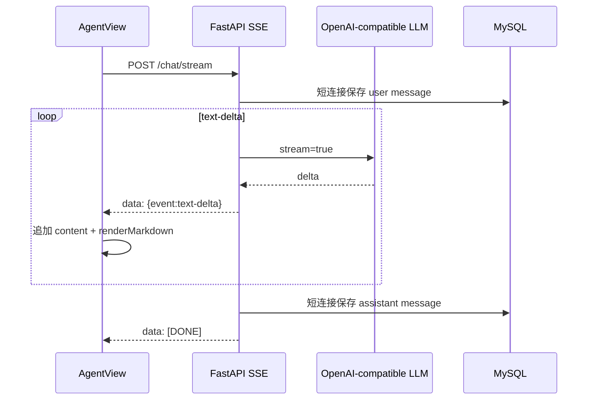

# Agent 对话流式输出与 Markdown 渲染

## 背景

选品 Agent 对话原先是「整段等待 → 一次性返回」，且前端用手写正则渲染 Markdown，**不支持表格**。长回复（含机会评分表）会先转圈几秒，再以原始 `| 类型 | ... |` 管道符文本显示。

## 方案设计

### 后端
- `call_llm(..., json_mode=False)`：对话不再强制 JSON mode
- `call_llm_stream()`：`stream=True` 解析 SSE chunk，yield 文本 delta
- `chat_stream()`：DB 短连接（写用户消息 → 流式 → 写助手消息），避免长请求占连接池
- 新端点 `POST /api/v1/agent/scans/{id}/chat/stream`，原 `/chat` 保留兼容

### 前端
- `apiStreamChat`：`fetch` + `ReadableStream` 消费 SSE（不用 EventSource）
- `lib/markdown.ts`：支持标题 / 列表 / **表格** / 加粗 / 链接 / 代码块
- 流式过程中助手气泡逐字更新，末尾光标动画；输入框处理 IME `isComposing`

### Nginx
- `/api/v1/agent/scans/` 专用 location：`proxy_buffering off`，避免 SSE 被缓冲

## 使用说明

在选品 Agent 对话输入问题后，应看到：
1. 助手气泡立即出现并逐字增长（非转圈后整段甩出）
2. Markdown 表格渲染为 HTML 表格，粗体/列表正常

## 性能与稳定性

- **DB 连接影响**: 流式期间不持有 DB；仅首尾短连接
- **内存峰值**: 单回复上限约 `max_tokens=4000`，可接受
- **队列/排队**: 无额外队列
- **Nginx 配置**: 已加 SSE 专用 location
- **全局影响**: 同步 httpx stream 跑在线程/worker 内，不阻塞其他请求的事件循环（本项目 FastAPI 默认 sync 路由在 threadpool）
